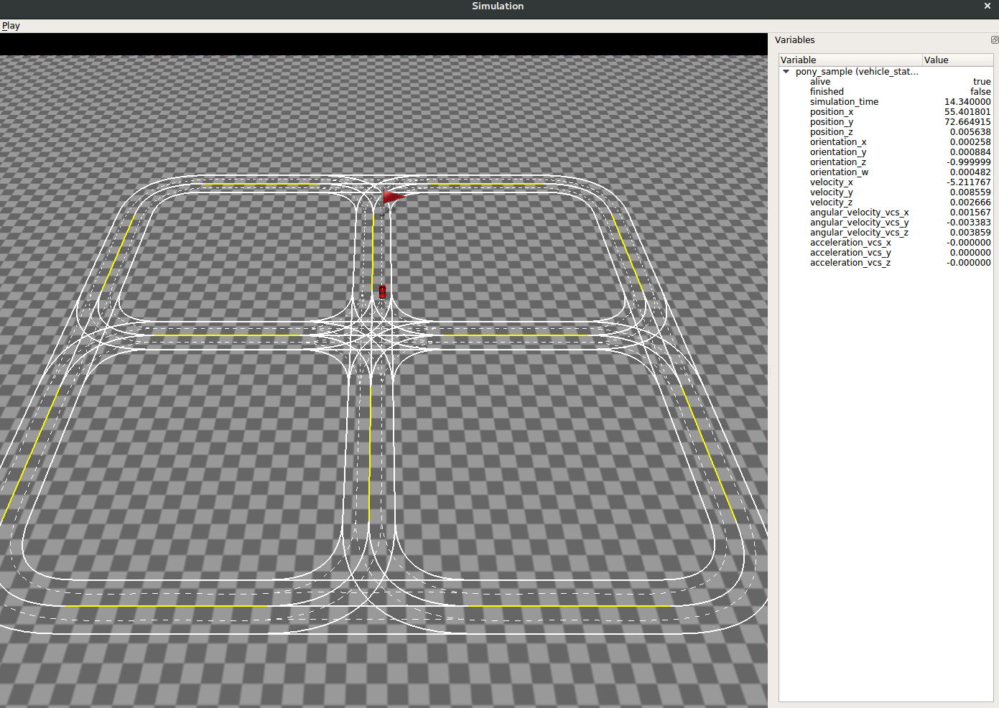

# HomeWork1

Great oaks from little acorns. Let's setup our environment and learn about basic tools first.

## Setup environment
You need a PC or virtual machine with [Ubuntu 16.04](http://releases.ubuntu.com/16.04/)
installed. 

Our visualization tool in future homework is based on OpenGL 3D rendering. We recommend using Ubuntu16.04 native system instead of virtual machine to get the best visualization effect, since 3D acceleration inside virtual machines is just experimental features. If you must use virtual machine for some reasons, we recommend [VirtualBox](https://www.virtualbox.org/wiki/Downloads), which is free and cross-platform.  

Then make sure you have installed [git](https://git-scm.com/),
[bazel](https://bazel.build/). Please follow [link](https://github.com/bazelbuild/bazel/releases/tag/2.2.0) to install bazel 2.2.0 version. 
Please use following command to install a few libraries. 
```
sudo apt-get install git qtdeclarative5-dev clang-6.0 nasm
```
Besides, we'll use some more libraries in Cpp, [gtest](https://github.com/google/googletest),
[protobuf](https://github.com/google/protobuf), [glog](https://github.com/google/glog),
[gflags](https://github.com/gflags/gflags). You don't need install them in your system,
`bazel` will download and put them to right path.
Please make sure you've grasped basic usage of them before we've gone deeper.

## Homework

### 1. Hello World!
Clone this repo with `git` by `git clone git@github.com:ponyai/PublicCourse.git`. Then use `bazel`
to build and run `helloworld` (e.g. `bazel run -c opt //homework1/helloworld:main`)
You can see some build information on screen and then the "Hello World!".

**Task:** add some code yourself to learn about how the build-system works.

### 2. Run Unittest
There is a demo about how to define class and test your code in `/homework1/unittest/`.
Run `bazel test -c opt //homework1/unittest:car_test` and you'll see all test cases have passed.

**Task:** complete the code in car_test.cc.

### 3. Protobuf
`Protobuf` is a very popular extensible mechanism for serializing structured data. It is
language-neutral and platform-neutral, you can generate Cpp code from `proto` files. We'll use
`protobuf` to store simple data structure for sensors message, please be familiar with it. There
is a demo about `protobuf` in /homework1/protobuf, please read about it.

**Task:** add one function to compute the length of a polyline (message `Polyline` in `/homework/protobuf/proto/geometry.proto`)
and add unittests to verify the correctness.

### 4. Get familiar with the simulation environment in the final project. 

As you may know, the final project will need you to implement an agent to compete with others in a simulation environment. To give you a first glance of the simulation system, you could run following command:

```
bazel run -c opt //pnc:simulation_main -- --multi_process_mode=false
```


You could see a vehicle running in a straight lane slowly in the simulation system. This is a sample agent which could just go straight. In your final project, you will need to implement an agent and compete with others. The simulation system contains a grid-based map. There are traffic lights on the map, and the color is shown at the corresponding stop line of the traffic light. There are also mocked pedestrians on the road. If the vehicle hits the mocked pedestrian, it will be eliminated. 
 
The red flag represents the destination of the route. When the car reached the destination, the red flag will disappear. A dock widget in the right-side of the main window shows the status of the running vehicle. 

Besides, you could press following keys on keyboard to try some UI actions:

1. `SPACE`: Pause the simulation. 
2. `+`: Speed up the simulation. 
3. `-`: Slow down the simulation. 
4. `RIGHT ARROW`: Run next iteration (only available when simulation is paused). 
5. `CTRL + Q`: Exit the simulaion

**Task:** In the homework1, you need to get the simulation environment compiled. You need to take a screenshot of the simulation. 

**What to submit:** A zip file which contains all files in `homework1` directory. 
