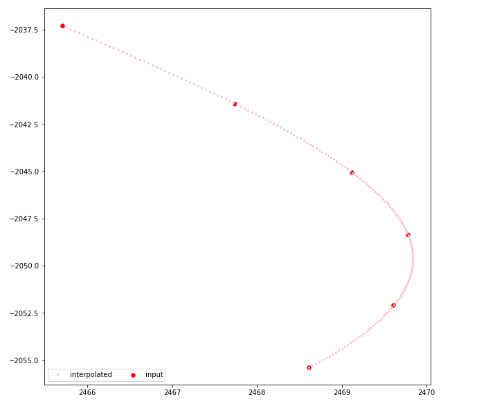

# Homework5

### 1. Cubic Spline Interpolation

Cubic spline interpolation is a widely used interpolation algorithm in map creation and trajectory generation. Given a list of 2D points on a X-Y plane, we will connect them with a piecewise cubic curve that has continuous second-order derivatives on the connection points (knots).

Step 1: Do your own research about cubic spline interpolation to understand the concept. You can find a lot of introductions online, or you can refer to any numerical analysis books or materials.

Step 2: Implement cubic spline interpolation algorithm by implementing the `CubicSpline` class. The function signatures have been provided.

Note: 
- You will not score this question if you use existing interpolation libraries or other ready-to -use implementation. You need to implement it from scratch.
- You should use "not-a-knot" spline when providing extra boundary condition. Search online for it if you don't know what it means.
- You can use Eigen (introduced in Homework 2) for building and solving linear equations. The choice of solver type won't be evaluated in this homework.

**What to submit:** Your `cubic_spline.h`, `cubic_spline.cc` and the code you use to test your implementation.

### 2. Interpolation on Real-world Car Trajectories
In this question, you are given 5 real-world car trajectories. Each trajectory contains some 2D points on a X-Y plane. You will need to use cubic spline interpolation to generate a smooth trajectory from given input discrete points.

In files like `input_data_1.txt`, every line contains the x and y coordinates of a point, separate by a space, like this:

```
2465.7 -2037.3
2467.74 -2041.43
……
```

Step 1: You should use your `CubicSpline` class to interpolate your data from all 5 data files. The interpolation interval could be, for example, 0.1.

Step 2: You need to use some visualization tool (e.g., matplotlib, gnuplot, MatLab, Javascript libraries, or even Excel) to visualize your interpolation curve. The visualization should contain the input data points and your curve. For example:



**What to submit:** Your C++ code that reads the input data file and do the interpolation, and 
your 5 visualization graph in png or jpg or pdf format.
